# DWERP-Agent Codebase Documentation

## 1. Purpose And Scope

This document explains the chatbot-centric DWERP codebase as it exists in this workspace on June 4, 2026.

The project is split across three sibling folders:

| Folder | Role in system | Primary stack |
|---|---|---|
| `DWERP-Agent` | AI agent service, chat orchestration, RAG, memory, analytics, write-action mediation | FastAPI, LangGraph, PostgreSQL, Redis |
| `DWERP-Backend-Revamped` | Core ERP backend and source-of-truth business API | Django, DRF, PostgreSQL, RBAC |
| `DWERP-Frontend-Revamped` | ERP web app and chat UI | React, TypeScript, Vite, Zustand |

Important workspace reality:

- `DWERP-Agent` contains the active AI backend.
- The actual frontend used with it is in `DWERP-Frontend-Revamped`.
- The actual ERP backend used with it is in `DWERP-Backend-Revamped`.
- `DWERP-Agent/README.md` mentions a frontend folder, but no `frontend/` directory exists inside `DWERP-Agent` in this workspace.

## 2. System Summary

At a high level, the chatbot is not a standalone product. It is an AI layer sitting on top of the DWERP ERP:

1. The React frontend renders the ERP UI and the DW AI chat sidebar.
2. The frontend sends normal business CRUD traffic to the Django ERP backend.
3. The frontend sends AI chat traffic to the FastAPI agent service through a Vite proxy path named `/agent-api`.
4. The FastAPI agent answers read questions mostly by querying the ERP PostgreSQL database directly.
5. When the AI proposes writes, it does not write business tables directly. It creates a draft action and, on user confirmation, calls the Django ERP API with the user's JWT.

This means the design intentionally separates:

- Read intelligence: direct AI access to database data and document knowledge.
- Write safety: ERP service-layer enforcement and RBAC still happen in Django.

## 3. High-Level Architecture

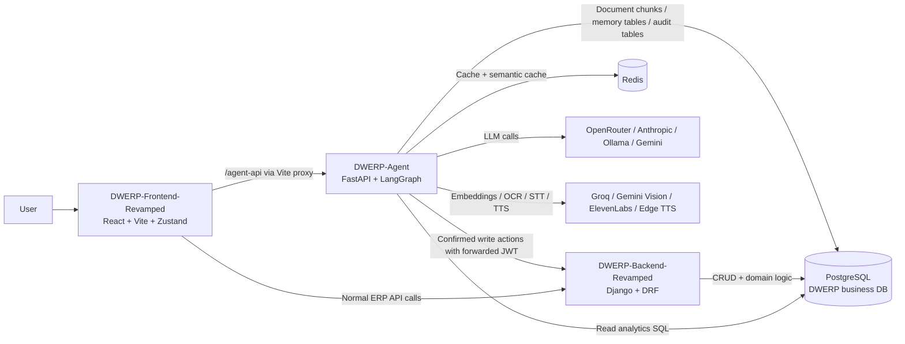

## 4. Request Routing And Runtime Boundaries

### 4.1 Frontend proxy rules

`DWERP-Frontend-Revamped/vite.config.ts` is one of the most important integration files:

| Incoming frontend path | Proxied target | Meaning |
|---|---|---|
| `/agent-api/*` | `http://localhost:8001/*` rewritten to `/api/*` | FastAPI agent endpoints |
| `/api`, `/media`, `/static`, `/uploads` and backend route prefixes | `http://localhost:8000/*` | Django ERP backend |

So when the frontend calls `/agent-api/chat`, the browser is really talking to the FastAPI service on port `8001`, and that becomes `/api/chat` inside the agent app.

### 4.2 Boundary model

| Responsibility | Implemented in |
|---|---|
| UI, page state, chat rendering, charts, confirmation cards | `DWERP-Frontend-Revamped` |
| Authentication used by main ERP UI | `DWERP-Backend-Revamped` |
| AI prompt orchestration, memory, RAG, streaming chat | `DWERP-Agent` |
| Business CRUD, approvals, RBAC, side effects, domain rules | `DWERP-Backend-Revamped` |
| Analytics reads for AI | Mostly `DWERP-Agent` direct SQL |

## 5. Repository Map

### 5.1 `DWERP-Agent`

| Path | What it contains | Why it matters |
|---|---|---|
| `backend/app/main.py` | FastAPI app bootstrap | Service entry point |
| `backend/app/api/v1/` | FastAPI routes | Chat, actions, upload, admin, insights, voice |
| `backend/app/agent/` | Core AI orchestration | Graph, tools, prompts, routing, ERP client |
| `backend/app/core/` | Shared infrastructure | Config, DB, Redis, security |
| `backend/app/services/` | App-level services | Conversation persistence |
| `backend/app/memory/` | Agent memory tiers | Query memory, error memory, personal memory |
| `backend/app/rag/` | Retrieval pipeline | Document search, schema RAG, extraction |
| `backend/app/scheduler/` | Background jobs | Daily brief, alerts, notifications |
| `backend/app/connectors/` | Data-source adapters | DWERP connector and website connector |
| `backend/app/utils/` | Cross-cutting helpers | Audit, cache, guardrails, SQL validation |

### 5.2 `DWERP-Frontend-Revamped`

| Path | What it contains | Why it matters |
|---|---|---|
| `src/main.tsx` | Global bootstrap and fetch interception | Response unwrapping, slash normalization |
| `src/App.tsx` | App routing | Main page composition and chat mounting |
| `src/hooks/useAuth.ts` | Auth store and auth workflows | JWT, tenant switching, company settings |
| `src/lib/api-client.ts` | Central ERP API client | Most frontend-to-Django communication |
| `src/stores/useChatStore.ts` | Central AI chat store | SSE parsing, thread loading, stream state |
| `src/components/common/ChatSidebar.tsx` | Main AI chat UI | Messages, feedback, actions, insights |
| `src/components/common/PushToTalk.tsx` | Voice upload shortcut | Calls `/agent-api/voice/chat` |
| `src/components/common/VoiceChatModal.tsx` | Voice stream UI | WebSocket to `/agent-api/voice/stream` |

### 5.3 `DWERP-Backend-Revamped`

| Path | What it contains | Why it matters |
|---|---|---|
| `DWERP_BE/settings.py` | Django settings | Middleware, REST config, DB, CORS |
| `DWERP_BE/urls.py` | Main route composition | Mounts domain apps and bridge endpoints |
| `auth_app/` | Auth and tenants | JWT issue, login, signup, tenant switching |
| `enquiry_app/` | Enquiry domain | A key module the AI queries and updates |
| `organization_app/` | Organization domain | Core CRM master records |
| `quotation_app/` | Quotation domain | Pipeline and commercial data |
| `site_survey_app/` | Survey domain | Site survey records and statuses |
| `settings_app/`, `masters_app/`, `catalogs_app/`, `approval_app/` | Supporting ERP modules | Used heavily by frontend |

## 6. Backend: DWERP-Agent Deep Dive

### 6.1 Service startup

`DWERP-Agent/backend/app/main.py` creates the FastAPI app and performs these startup steps:

1. Configure logging.
2. Initialize PostgreSQL pool and verify connection.
3. Initialize Redis.
4. Initialize connector registry.
5. Preload the reranker model.
6. Start APScheduler background jobs.

Routers mounted in `main.py`:

| Route prefix | File | Purpose |
|---|---|---|
| `/health` | `api/v1/health.py` | Health probe |
| `/api/auth/*` | `api/v1/auth.py` | Agent-local auth helper |
| `/api/chat*` | `api/v1/chat.py`, `api/v1/chat_history.py` | Main chat and thread history |
| `/api/action*` | `api/v1/action.py` | Confirm and execute AI-proposed actions |
| `/api/connectors*` | `api/v1/connectors.py` | Connector listing and switching |
| `/api/history` | `api/v1/history.py` | Redis conversation history |
| `/api/admin/*` | `api/v1/admin.py`, `api/v1/upload.py` | Usage analytics, memory admin, document management |
| `/api/insights` | `api/v1/insights.py` | Proactive insight chips |
| `/api/daily-brief` | `api/v1/daily_brief.py` | On-demand daily brief |
| `/api/website/*` | `api/v1/website.py` | Public website chatbot |

Note: `voice.py` exists, but the voice router is commented out in `main.py` in the current snapshot, even though frontend components already reference voice endpoints.

### 6.2 Core config and environment model

`backend/app/core/config.py` uses `pydantic-settings` and defines the main runtime configuration.

#### Agent environment variables

| Variable | Purpose |
|---|---|
| `APP_NAME`, `APP_VERSION`, `DEBUG`, `ENVIRONMENT`, `LOG_LEVEL` | General app settings |
| `DATABASE_URL`, `DATABASE_POOL_SIZE`, `DATABASE_POOL_MAX` | PostgreSQL connectivity |
| `REDIS_URL` | Redis cache / history storage |
| `OPENROUTER_API_KEY`, `OPENROUTER_BASE_URL` | Primary cloud model access |
| `TIER1_MODEL`, `TIER2_MODEL`, `TIER3_MODEL` | Model routing tiers |
| `OLLAMA_BASE_URL`, `OLLAMA_MODEL` | Local fallback model |
| `GOOGLE_API_KEY`, `GEMINI_MODEL` | Gemini embeddings / vision / TTS paths |
| `ANTHROPIC_API_KEY`, `CLAUDE_MODEL` | Direct Anthropic fallback |
| `JWT_SECRET`, `JWT_ALGORITHM`, `JWT_EXPIRY_HOURS` | Agent-issued JWTs |
| `CORS_ORIGINS` | Browser access control |
| `GROQ_API_KEY` | Audio transcription path |
| `ELEVENLABS_API_KEY`, `ELEVENLABS_VOICE_ID` | Premium TTS |
| `DEEPGRAM_API_KEY` | Configured, but not prominent in current code paths |
| `ERP_BASE_URL` | Django ERP API base for write actions |
| `MAX_UPLOAD_SIZE_MB` | Document upload size cap |
| `RATE_LIMIT_PER_MINUTE` | Generic rate settings |
| `CACHE_TTL_SECONDS` | Redis cache TTL |

Important behavior:

- `JWT_SECRET` is auto-generated only in development when absent.
- Production requires a real secret of at least 32 characters.
- `ERP_BASE_URL` defaults to `http://localhost:8000`, which is how the agent talks back to Django for writes.

### 6.3 Security and tenant resolution

`backend/app/core/security.py` is central to auth behavior.

What it does:

1. Accepts the agent's own JWT format.
2. Accepts DWERP JWTs using a separate hardcoded secret path.
3. Supports `X-Tenant-ID` header overrides if the user has access.
4. Falls back to looking up the user in `auth_user` to resolve tenant membership.

`CurrentUser` carries:

- `id`
- `email`
- `name`
- `role`
- `tenant_id`

Important implementation details:

- `_lookup_tenant()` queries the shared business DB table `auth_user`.
- `get_current_user()` treats `demo-token` specially.
- There is a dev fallback path that decodes some external JWTs without verification if they contain `sub`.

This makes the agent tolerant during integration, but it is also one of the main risk areas discussed later.

#### 6.3.1 Tenant-resolution decision flow

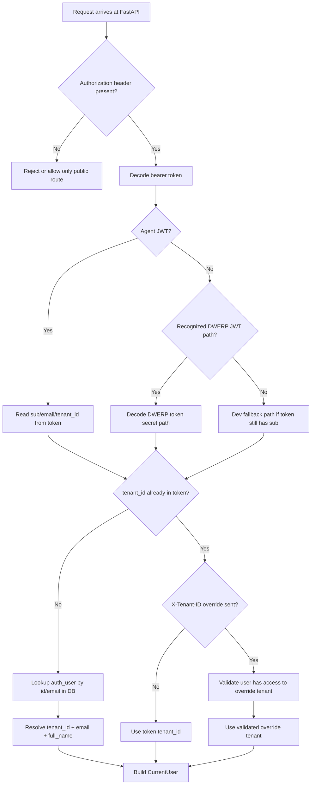

Explanation:

- The agent is intentionally permissive compared with the Django backend because it has to interoperate with multiple token shapes during migration.
- If tenant context is missing from the token, the agent resolves it from `auth_user`.
- `X-Tenant-ID` is not blindly trusted; the code checks whether the user can actually access that tenant.
- The real security hard boundary for writes still lives in Django, not in FastAPI.

### 6.4 Database and Redis infrastructure

`backend/app/core/database.py`:

- Uses `asyncpg` with a shared global pool.
- Converts named placeholders like `:tenant_id` into PostgreSQL positional parameters.
- Provides:
  - `get_pool()`
  - `execute_query()`
  - `execute_query_admin()`
  - `fetch_schema()`
  - `verify_connection()`

`backend/app/core/redis.py` and `backend/app/utils/cache.py`:

- Store exact chat-response cache entries.
- Store semantic cache shards keyed by tenant, mode, persona, module, and record.
- Maintain Redis-backed conversation history in some legacy routes.

Cache behavior worth knowing:

- Exact cache key includes question, tenant, mode, persona, module, and record context.
- Semantic cache only applies when the chat flow allows it and the response is suitable for reuse.
- Cache is intentionally bypassed by the frontend after a confirmed write action.

### 6.5 Connectors

`backend/app/connectors/registry.py` registers two connectors:

| Connector | Purpose |
|---|---|
| `DwerpConnector` | ERP data and schema context for the authenticated product chat |
| `WebsiteConnector` | Public msbcgroup.com knowledge base chat |

`backend/app/connectors/dwerp.py` is especially important:

- Hard-codes a hand-verified schema description.
- Includes many few-shot NL-to-SQL examples.
- Encodes known schema mistakes and anti-patterns.
- Exposes chart mapping hints.

This file is effectively part schema dictionary, part prompt-engineering asset, and part guardrail.

### 6.6 Chat orchestration

The primary agent runtime is `backend/app/agent/graph.py`.

Core responsibilities:

- Build a LangGraph graph with a chatbot node and tool node.
- Inject tenant, user, module, record, and voice context through `ContextVar`s.
- Perform query classification and select model/provider.
- Retrieve:
  - few-shot examples
  - schema RAG context
  - successful SQL memories
  - prior error memories
  - connector facts
- Run tools as needed.
- Convert final results into UI-friendly streaming chunks.

#### Main tools available to the LLM

| Tool | File | Purpose |
|---|---|---|
| `dwerp_sql_query` | `agent/tools.py` | Tenant-scoped SQL analytics |
| `search_documents` | `agent/tools.py` | Hybrid document RAG |
| `search_agent_memory` | `agent/tools.py` | Search historical learned memory |
| `propose_action` | `agent/tools.py` | Draft a safe write action |
| `get_job_blockers` | `agent/tools.py` | Specialized operational insight |
| `get_attention_items` | `agent/tools.py` | Dashboard-style priority items |
| `get_recent_activity` | `agent/tools.py` | Recent status-history summary |

#### 6.6.1 Internal chat lifecycle

The best mental model for `run_agent()` is that it is not just "send prompt to model". It is a staged pipeline:

1. Guard the input against obvious prompt injection.
2. Decide whether this is onboarding, casual talk, document knowledge, CRM analytics, or a write-style request.
3. Load user memory, company memory, and optional page context.
4. Decide whether to use a conversational fast path or the full LangGraph path.
5. Retrieve support context:
   - schema hints
   - successful SQL memories
   - past SQL errors
   - learned connector facts
   - recent conversation history
6. Let the model call tools until it has enough evidence.
7. Convert raw results into UI-oriented chunk types.
8. Persist conversation, audit logs, feedback learnings, and topic insights.

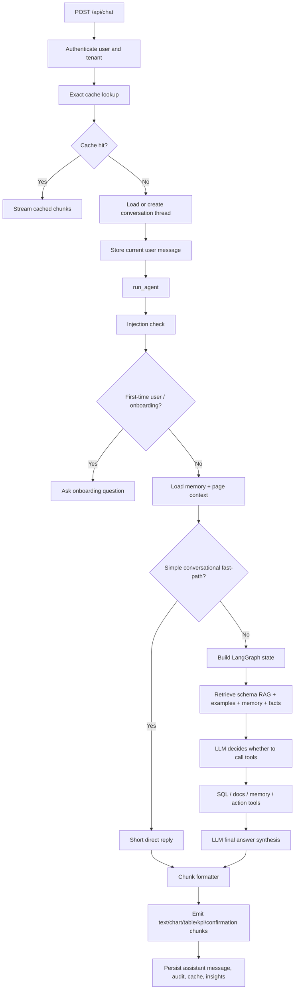

Explanation:

- The "graph" part matters only on questions that need data or tools.
- Many short conversational turns skip the heavier graph path entirely to reduce cost and latency.
- The formatter stage is important because the frontend is not expecting one plain string; it expects typed chunks it can turn into charts, cards, and confirmation widgets.

#### 6.6.2 Why the agent can feel context-aware

The agent combines several different kinds of context at once:

| Context type | Where it comes from | Example effect |
|---|---|---|
| Tenant context | JWT or DB lookup | Prevents cross-tenant data leakage |
| Thread context | `conversations` table | Lets follow-up questions build on prior turns |
| Page context | `module` and `record_id` from frontend | "What is pending on this quotation?" can target the current record |
| Personal memory | `user_memory` | Tailors phrasing, onboarding, and proactive content |
| Company memory | `company_memory` | Tenant-wide preferences or durable facts |
| Connector knowledge | `connector_knowledge` | Learned enum values and quick facts |
| Query memory | `agent_memory` | Reuses successful SQL patterns |
| Error memory | `agent_error_log` | Avoids repeating broken SQL |

### 6.7 Model routing

`backend/app/agent/router.py` determines which model path is used.

Observed logic:

- Complexity classifier uses a lightweight keyword-based approach.
- When multi-tier mode is not enabled, routing is effectively forced into a simplified path.
- Provider order is roughly:
  1. OpenRouter when configured
  2. Direct Anthropic if configured
  3. Local Ollama fallback

### 6.8 Prompt construction

`backend/app/agent/prompts.py` is one of the most important files in the whole project.

It contains a large system prompt that defines:

- persona
- schema use rules
- SQL restrictions
- module-specific action instructions
- document search rules
- response style rules
- chart and KPI expectations
- write-action conventions
- voice mode adjustments

This file is the behavior contract for the LLM. New developers should read it early.

### 6.9 Memory system

The agent uses several memory layers.

| Memory layer | File | Stored data | Used for |
|---|---|---|---|
| Query memory | `memory/query_memory.py` | Successful question to SQL pairs | Better future SQL generation |
| Error memory | `memory/error_memory.py` | Failed SQL and corrections | Avoid repeating mistakes |
| Personal memory | `memory/personal_memory.py` | User preferences, onboarding, topic history | Personalization and proactive UX |
| Connector knowledge | `memory/connector_knowledge.py` | Tenant facts and learned enums | Prompt augmentation |

Notes:

- Query embeddings are generated through Gemini embedding APIs.
- Feedback from `/api/chat/feedback` is wired back into memory scoring.
- Personal memory also drives the onboarding sequence for first-time users.

### 6.10 RAG and document ingestion

Key files:

| File | Role |
|---|---|
| `rag/search.py` | Hybrid retrieval over document chunks and facts |
| `rag/schema_rag.py` | Schema description retrieval |
| `rag/extractor.py` | Text extraction from uploaded files |

Supported extraction paths include:

- PDF
- DOCX
- XLSX
- CSV
- plain text
- audio
- image

External service usage in extraction:

- Groq Whisper path for transcription
- Gemini vision path for image understanding

#### 6.10.1 Upload status pipeline

The upload endpoint is more than a file drop. It has explicit lifecycle stages stored on the document row:

- `processing`
- `extracting`
- `chunking`
- `embedding`
- `ready`
- `error`


Explanation:

- The HTTP upload request returns immediately after queueing work.
- Actual extraction and embedding happen in a background task.
- The document row is updated as it moves through each stage, which is why the frontend can poll processing status.

### 6.11 Conversation persistence

`backend/app/services/conversation_service.py` is the primary conversation persistence service.

It stores conversation rows in a `conversations` table and provides:

- thread creation
- message append
- list threads
- rename thread
- archive thread
- search conversations
- auto-title
- feedback annotation
- stale auto-archive

Messages are stored as JSONB arrays inside the conversation row.

#### 6.11.1 What thread persistence enables

Because thread history is durable, the product can support:

- named chat threads
- reload of prior conversations
- feedback attached to previous assistant messages
- auto-titling of a new conversation from the first query
- future analytics on user interests and query patterns

### 6.12 Action engine and safe writes

The write path is intentionally split from normal AI answer generation.

Important files:

| File | Role |
|---|---|
| `agent/action_registry.py` | Declares allowed AI actions |
| `agent/action_engine.py` | Drafts, validates, logs, executes actions |
| `agent/erp_client.py` | Forwards confirmed action calls to Django ERP |
| `api/v1/action.py` | Public FastAPI endpoints for confirm/cancel/status |

How it works:

1. The LLM uses `propose_action`.
2. The action engine validates payload shape, required fields, and UUIDs.
3. It creates a draft row in `ai_action_log` when possible.
4. The frontend shows a confirmation card.
5. On user confirmation, the frontend calls `/agent-api/action/execute`.
6. The FastAPI service forwards the user's JWT and `X-Tenant-ID` to the Django ERP API.
7. Django RBAC and business services enforce the real write.

This is one of the strongest design decisions in the codebase.

## 7. Backend: DWERP-Backend-Revamped Deep Dive

### 7.1 Architectural style

The Django backend follows a service-oriented pattern:

- ViewSets in `views/`
- serializers in `serializers/`
- service-layer logic in `services/`
- model definitions in `models/`

Representative example:

- `auth_app/services/auth_service.py` contains most login, signup, invite, role assignment, and tenant-switching logic.
- The views are comparatively thin and delegate to services.

### 7.2 Django settings and middleware

`DWERP_BE/settings.py` configures:

- DRF
- CORS
- custom JSON renderer
- custom exception handling
- JWT auth via middleware rather than DRF auth classes

`auth_app/middleware.py` is especially important because it:

1. Validates JWTs.
2. Loads the request user.
3. Resolves tenant context.
4. Supports `X-Tenant-ID` override when valid.
5. Sets PostgreSQL session variables for row-level scoping.

That middleware is the backbone of multi-tenant behavior in the ERP layer.

#### 7.2.1 Why the Django middleware matters more than it first appears

The middleware is doing three jobs at once:

1. Authentication: verify the JWT.
2. Authorization context: attach roles and tenant to the request.
3. Database scoping: set PostgreSQL settings such as `app.tenant_id` so downstream queries and RLS policies can see the active tenant.

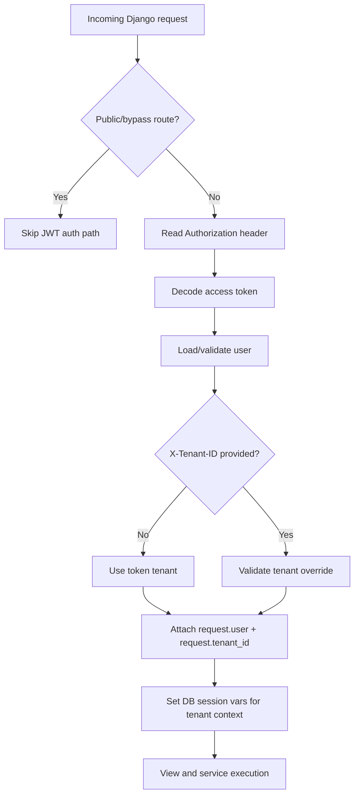

Explanation:

- This is one reason the AI write path forwards the user's JWT into Django instead of writing directly.
- It ensures every confirmed write still goes through the same middleware, tenant checks, and service-layer permissions as a normal ERP button click.

### 7.3 Major ERP apps used by the chatbot ecosystem

| App | Main responsibility | Relevance to chatbot |
|---|---|---|
| `auth_app` | Users, tenants, JWT, roles | Auth source and tenant identity |
| `organization_app` | Organizations and contacts | Heavily queried by AI |
| `enquiry_app` | Enquiries, follow-ups | Heavily queried and updated |
| `quotation_app` | Quotations and revisions | Heavily queried and updated |
| `site_survey_app` | Site surveys | Queried and may be action targets |
| `approval_app` | Approval rules/limits | Important for write workflows |
| `settings_app`, `masters_app`, `catalogs_app` | ERP setup data | Used broadly by frontend |

### 7.4 Auth service behavior

`auth_app/services/auth_service.py` shows that the Django backend is the main real auth system for the frontend.

What it handles:

- signup
- login
- token refresh logic
- forgot/reset password
- email verification
- tenant creation
- role seeding
- invites
- tenant switching

This is the JWT source the frontend primarily relies on.

## 8. Frontend: DWERP-Frontend-Revamped Deep Dive

### 8.1 Frontend architecture

The frontend is a large React 19 + Vite application. The chatbot is not a separate SPA; it is mounted into the ERP shell.

Key patterns:

- `useAuth.ts` for auth and tenant state
- `api-client.ts` for normal ERP calls
- `useChatStore.ts` for AI chat state
- `ChatSidebar.tsx` as the main user-facing chatbot surface

### 8.2 Global bootstrap behavior

`src/main.tsx` does several nontrivial things:

- applies theme
- disables service worker behavior
- intercepts global `fetch`
- normalizes Django trailing slashes
- unwraps `{ success, data }` envelopes
- handles read-only demo errors
- forces reload on stale lazy chunks

This means network behavior is partially standardized at bootstrap, not only in `api-client.ts`.

#### 8.2.1 Why `main.tsx` is easy to underestimate

The bootstrap file effectively acts like a mini networking middleware layer in the browser:

- normalizes missing trailing slashes for Django routes
- unwraps success envelopes even for raw `fetch` calls outside `api-client.ts`
- converts some backend media paths into browser-safe URL forms
- reloads stale Vite chunk errors automatically after deploys
- blocks scientific-notation keystrokes in numeric inputs across the app

That means a bug in this file can affect nearly every page, even when page code looks correct.

### 8.3 Normal ERP data client

`src/lib/api-client.ts` is the main frontend-to-Django bridge.

What it does:

- auto-appends trailing slash
- attaches `Authorization`
- attaches `X-Tenant-ID`
- unwraps response envelopes
- handles `401` by logout and redirect
- exposes a very large set of typed methods for ERP modules

Important practical consequence:

- Most page-level business data does not hit the FastAPI agent.
- It goes directly from React to Django through this client.

#### 8.3.1 ERP request lifecycle from the browser

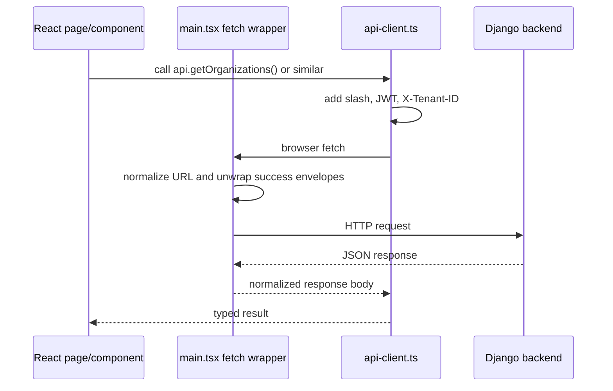

Explanation:

- `api-client.ts` is the typed API layer.
- `main.tsx` is the global network shaper.
- Both participate in making the frontend-to-Django contract work reliably.

### 8.4 Frontend auth flow

`src/hooks/useAuth.ts` manages:

- JWT persistence in local storage under `dw-erp-jwt`
- login/signup/session recovery
- tenant switching
- company settings fetch
- derived role helpers

This confirms the frontend is using Django-backed auth, not an agent-owned auth flow.

#### 8.4.1 Frontend auth and tenant switching diagram

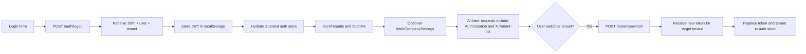

Explanation:

- Tenant switching is not just a client-side dropdown change.
- The frontend asks the backend for a tenant switch and receives a new token scoped to that tenant context.
- That token is then used for both normal ERP requests and agent requests.

### 8.5 Chat store and streaming behavior

`src/stores/useChatStore.ts` is the most important frontend file for chatbot behavior.

Responsibilities:

- open/close chat
- hold thread list and active thread
- send user messages
- create temporary assistant message placeholders
- call `/agent-api/chat`
- parse SSE stream lines
- append text chunks to the main assistant bubble
- create separate structured messages for:
  - `chart`
  - `table`
  - `kpi`
  - `confirmation`
  - `draft_message`
- mark `justWrote = true` after a confirmed action so next read skips cache

### 8.6 Chat UI behavior

`src/components/common/ChatSidebar.tsx` renders:

- floating sidebar UI
- thread history
- markdown replies
- charts using Recharts
- KPI cards
- tables
- feedback buttons
- action confirmation cards
- draft message cards
- proactive insight toast
- page-aware context chips
- voice entry points

It also determines page context from the current URL and passes `module` and `record_id` into chat requests, which lets the AI answer in-record context.

## 9. Data Flow

### 9.1 Normal frontend-to-ERP request flow

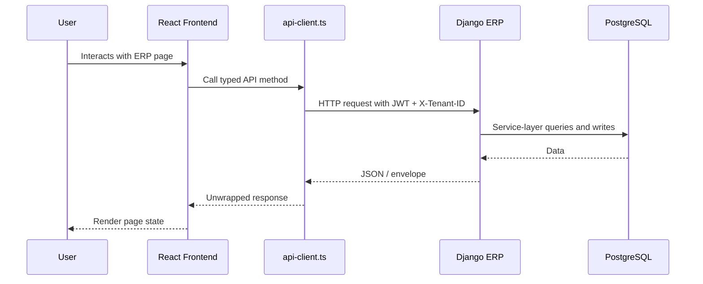

### 9.2 Authenticated AI chat read flow

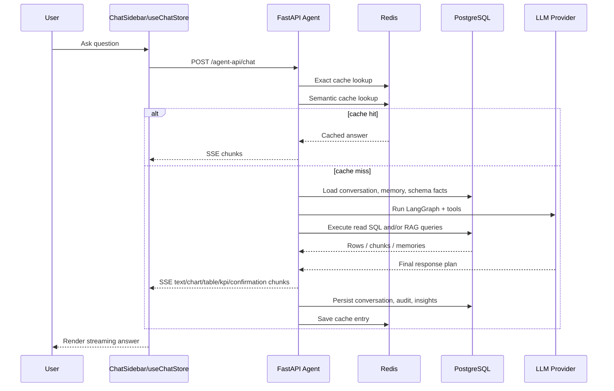

### 9.3 Confirmed AI write flow

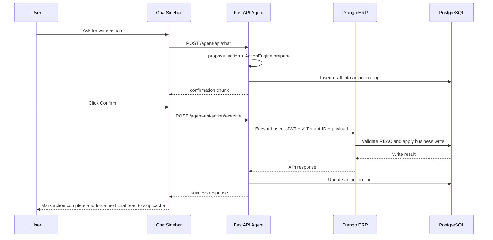

### 9.4 Document upload and RAG flow

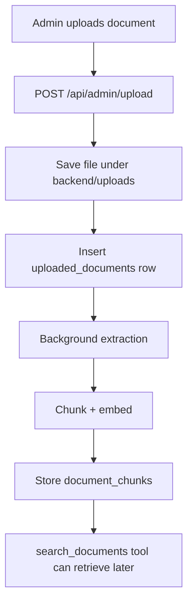

### 9.5 Frontend rendering of streamed AI chunks

One of the most important UI details is that the agent streams typed events, not only text.

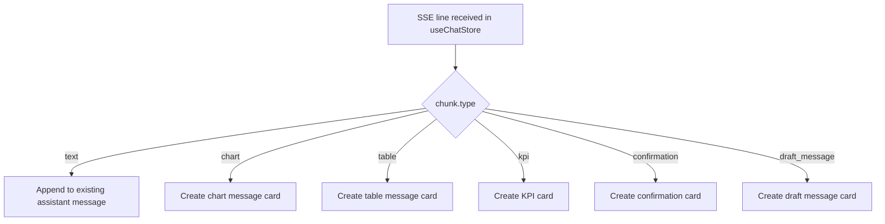

Explanation:

- This is why one chat turn may produce several visual blocks.
- The assistant "message" the user sees is really a composite of multiple streamed UI elements.

### 9.6 Scheduler and notification flow

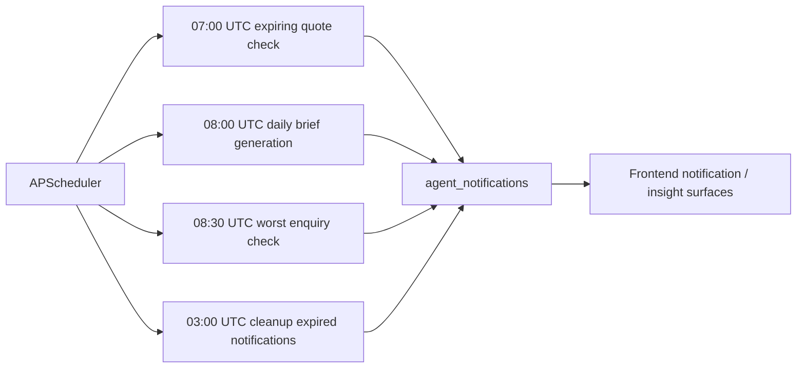

Explanation:

- Proactive UX in this codebase is not primarily LLM-driven.
- Much of it is deterministic SQL plus scheduled notification generation.

### 9.7 Public website chatbot isolation

```mermaid
flowchart TD
    A[Website visitor] --> B[/api/website/chat]
    B --> C[Rate limit by IP and session]
    C --> D[Sanitize and jailbreak-check input]
    D --> E[WebsiteConnector retrieve()]
    E --> F[Website-specific system prompt]
    F --> G[LLM response]
    G --> H[Output filtering]
    H --> I[Optional analytics writes in website_analytics schema]
```

Explanation:

- This flow is deliberately separated from tenant chat.
- It uses an isolated DB pool and a different prompt contract so website visitors cannot touch ERP data paths.

## 10. Important Agent API Endpoints

### 10.1 Chat and thread APIs

| Endpoint | Method | Implemented in | Used by frontend | Purpose |
|---|---|---|---|---|
| `/api/chat` | `POST` | `api/v1/chat.py` | `useChatStore.ts` | Main SSE chat endpoint |
| `/api/chat/feedback` | `POST` | `api/v1/chat.py` | `ChatSidebar.tsx` | Thumbs up/down feedback |
| `/api/chat/threads` | `GET` | `api/v1/chat_history.py` | `useChatStore.ts` | List conversation threads |
| `/api/chat/threads/{thread_id}` | `GET` | `api/v1/chat_history.py` | `useChatStore.ts` | Load thread messages |
| `/api/chat/threads/{thread_id}` | `DELETE` | `api/v1/chat_history.py` | `useChatStore.ts` | Archive/remove thread |
| `/api/chat/threads/{thread_id}/title` | `POST` | `api/v1/chat_history.py` | `ChatSidebar.tsx` | Rename thread |

### 10.2 Action APIs

| Endpoint | Method | Implemented in | Used by frontend | Purpose |
|---|---|---|---|---|
| `/api/action/execute` | `POST` | `api/v1/action.py` | `ChatSidebar.tsx` | Confirm and execute proposed action |
| `/api/action/{action_id}/cancel` | `POST` | `api/v1/action.py` | `ChatSidebar.tsx` | Cancel drafted action |
| `/api/action/{action_id}` | `GET` | `api/v1/action.py` | Not obviously used in current frontend | Read action status |

### 10.3 Insight and admin APIs

| Endpoint | Method | Implemented in | Used by frontend | Purpose |
|---|---|---|---|---|
| `/api/insights` | `GET` | `api/v1/insights.py` | `ChatSidebar.tsx` | Prompt chips and proactive messages |
| `/api/proactive-greeting` | `GET` | `api/v1/insights.py` | Agent-side feature surface, not obvious in current frontend | Personalized greeting |
| `/api/daily-brief` | `POST` | `api/v1/daily_brief.py` | Notification/brief flows | Generate today's brief |
| `/api/admin/usage/*` | `GET` | `api/v1/admin.py` | Admin surfaces | Usage analytics |
| `/api/admin/memory/*` | `GET` | `api/v1/admin.py` | Admin surfaces | Memory inspection |
| `/api/admin/facts` | `GET/POST` | `api/v1/admin.py` | `ChatSidebar.tsx` admin helper | Add/list quick facts |
| `/api/admin/facts/{id}` | `DELETE` | `api/v1/admin.py` | Admin surfaces | Remove quick fact |
| `/api/admin/corrections` | `GET/POST` | `api/v1/admin.py` | Admin surfaces | Add/list answer corrections |

Notes about `/api/insights`:

- It is SQL-driven, not LLM-driven.
- It returns page-aware suggestion chips.
- It is used both for proactive toasts and for idle prompt suggestions when the chat opens on an empty thread.

### 10.4 Upload and knowledge APIs

| Endpoint | Method | Implemented in | Purpose |
|---|---|---|---|
| `/api/admin/upload` | `POST` | `api/v1/upload.py` | Upload knowledge documents |
| `/api/admin/upload/{doc_id}/status` | `GET` | `api/v1/upload.py` | Processing status |
| `/api/admin/documents` | `GET` | `api/v1/upload.py` | List uploaded docs |
| `/api/admin/documents/{doc_id}` | `DELETE` | `api/v1/upload.py` | Delete uploaded doc |
| `/api/admin/documents/{doc_id}/chunks` | `GET` | `api/v1/upload.py` | Inspect processed chunks |
| `/api/admin/documents/{doc_id}/reprocess` | `POST` | `api/v1/upload.py` | Rebuild chunks/embeddings |

### 10.5 Auxiliary APIs

| Endpoint | Method | Implemented in | Purpose |
|---|---|---|---|
| `/health` | `GET` | `api/v1/health.py` | Service health |
| `/api/connectors` | `GET` | `api/v1/connectors.py` | Connector metadata |
| `/api/connectors/switch` | `POST` | `api/v1/connectors.py` | Active connector switching |
| `/api/history` | `GET` | `api/v1/history.py` | Legacy Redis history lookup |
| `/api/website/chat` | `POST` | `api/v1/website.py` | Public website chatbot |
| `/api/website/health` | `GET` | `api/v1/website.py` | Public website chatbot health |

### 10.6 Voice APIs present in code

These exist in `api/v1/voice.py`, but router wiring is incomplete in the current app snapshot.

| Endpoint | Method | Frontend references | Purpose |
|---|---|---|---|
| `/api/voice/ask` | `POST` | `VoiceChat.tsx`, `VoiceCommandPalette.tsx` | Voice-to-chat request |
| `/api/voice/speak` | `POST` | `VoiceCommandPalette.tsx` | TTS audio generation |
| `/api/voice/chat` | `POST` | `PushToTalk.tsx` | Short-command voice path |
| `/api/voice/transcribe` | `POST` | Not obvious | Standalone transcription |
| `/api/voice/stream` | `WS` | `VoiceChatModal.tsx` | Streaming voice session |

## 11. Chat Request And Response Contracts

### 11.1 Chat request body

`DWERP-Agent/backend/app/models/chat.py` defines the main request shape.

| Field | Type | Purpose |
|---|---|---|
| `message` | string | User's text |
| `conversation_id` | optional string | Legacy conversation identifier |
| `connector` | string | Usually `dwerp` |
| `mode` | `all | crm | knowledge` | Limits tool behavior |
| `persona` | `professional | smart | casual` | Response tone |
| `thread_id` | optional string | Persistent thread identity from frontend |
| `module` | optional string | Current ERP module page context |
| `record_id` | optional string | Current ERP record UUID |
| `skip_cache` | boolean | Force next answer to bypass cache |

In practice, `useChatStore.ts` sends:

- `message`
- `connector: "dwerp"`
- `mode`
- `persona`
- `thread_id`
- `user_id`
- optional `module`
- optional `record_id`
- optional `skip_cache`

### 11.2 Stream chunk types

The same model file defines the chunk contract the frontend expects:

| Chunk type | Meaning | Frontend rendering behavior |
|---|---|---|
| `text` | Main answer text | Appended into current assistant bubble |
| `chart` | Structured chart payload | New chart card/message |
| `table` | Structured table payload | New table card/message |
| `kpi` | Key number payload | New KPI card/message |
| `confirmation` | Proposed action preview | Confirmation card |
| `draft_message` | Draft WhatsApp/email/payment reminder | Draft message card |
| `status` | Internal progress update | Ignored by current chat UI |
| `error` | Failure message | Rendered as error |

This split is why one user question may appear as multiple assistant cards in the UI.

## 12. Important ERP Backend Endpoints Consumed By The Frontend

The ERP backend surface is very large, so the most useful way to understand it is by category.

### 12.1 Auth and tenant endpoints

| Endpoint family | Used from | Purpose |
|---|---|---|
| `/auth/login/`, `/auth/signup/`, `/auth/forgot-password/`, `/auth/reset-password/`, `/auth/verify-email/` | `api-client.ts`, `useAuth.ts` | Main UI auth |
| `/tenants/my/`, `/tenants/switch/` | `api-client.ts`, `useAuth.ts` | Multi-tenant UX |
| `/auth/users/`, `/users/{id}/` | `api-client.ts` | User list/update |

### 12.2 Core CRM endpoints

| Endpoint family | Purpose |
|---|---|
| `/organizations/*` | Organizations, contacts, docs, follow-ups |
| `/enquiries/*` | Enquiries and related follow-ups/documents |
| `/quotations/*` | Quotations and quotation positions |
| `/surveys/*` | Site surveys |

### 12.3 ERP configuration and master data

| Endpoint family | Purpose |
|---|---|
| `/settings/*` | Company and system settings |
| `/catalogs/*` | Product and catalog data |
| `/masters/*` | Common lookup/master data |
| `/approvals/*` | Approval rules and limits |

The frontend's `api-client.ts` is the best catalog of currently consumed Django endpoints.

## 13. Action Registry Map

`DWERP-Agent/backend/app/agent/action_registry.py` is the single source of truth for actions the AI is allowed to propose.

### 13.1 Action families

| Action family | Examples | Backend target |
|---|---|---|
| Enquiry actions | create, update, assign estimator, mark lost, reopen | `/enquiries/*` |
| Enquiry child actions | products, follow-ups | `/enquiries/{id}/products/*`, `/enquiries/{id}/follow-ups/*` |
| Quotation actions | create, update, mark ready, verify, approve, send, confirm, reject, revise | `/quotations/*` |
| Quotation child actions | positions, follow-ups, notes | `/quotations/{id}/positions/*`, follow-ups, notes |
| Organization actions | create, update, status change | `/organizations/*` |
| Organization child actions | contacts, follow-ups | `/organizations/{id}/contacts/*`, follow-ups |
| Survey actions | create, update, assign engineer, start, complete, close | `/surveys/*` |
| Survey child actions | measurements, notes, follow-ups | `/surveys/{id}/measurements/*`, notes, follow-ups |
| Draft-only actions | draft WhatsApp, draft email, draft payment reminder | No ERP call |

### 13.2 Confirmation model

| Confirmation level | Meaning |
|---|---|
| `preview` | Reversible or lower-risk action |
| `strong_confirm` | Irreversible or high-risk action |
| `None` | Draft-only message action |

Examples of strong-confirm actions:

- `mark_enquiry_lost`
- `remove_enquiry_product`
- `remove_quotation_position`
- `confirm_quotation`
- `mark_quotation_lost`
- `reject_quotation`
- `remove_contact`
- `remove_survey_measurement`

### 13.3 Why this file matters

This registry is where the AI's write perimeter is defined. If an action is not in this file, the AI should not be able to execute it through the formal write path.

It is also where you should verify action/backend compatibility during maintenance:

- Is the Django endpoint still mounted at the same path?
- Does the endpoint still accept the same payload shape?
- Are required fields still correct?
- Is the confirmation level still appropriate for the business risk?

## 14. Major Features Explained Step By Step

### 14.1 Feature: Authenticated chat answer

1. The user opens the DW AI sidebar.
2. `ChatSidebar.tsx` gathers current page context and user state.
3. `useChatStore.ts` sends `/agent-api/chat` with:
   - `message`
   - `connector`
   - `mode`
   - `persona`
   - `thread_id`
   - `module`
   - `record_id`
4. FastAPI authenticates the JWT and resolves tenant context.
5. The chat endpoint checks exact and semantic caches.
6. On a miss, it loads recent conversation messages and appends the new user message.
7. `run_agent()` in `agent/graph.py` performs:
   - injection checks
   - onboarding/personalization checks
   - fast-path conversational handling when appropriate
   - LangGraph tool orchestration when data is needed
8. Tools query SQL, documents, memories, and facts.
9. The agent emits SSE chunks back to the frontend.
10. The frontend renders:
   - one main assistant text bubble
   - separate structured cards for KPI/table/chart/action content
11. The backend persists the final assistant message, logs usage, and stores learnings.

### 14.2 Feature: Proposed action and confirmation

1. The user asks the AI to do something write-like.
2. The prompt tells the model to use `propose_action` rather than inventing a direct write.
3. `ActionEngine.prepare()` validates the payload and action definition.
4. The backend returns a `confirmation` chunk with:
   - action label
   - entity
   - summary
   - editable fields
   - confirmation strength
5. `ChatSidebar.tsx` renders a confirmation card.
6. The user can edit exposed fields before confirming.
7. On confirm, frontend calls `/agent-api/action/execute`.
8. The agent forwards the same JWT to Django through `ERPClient`.
9. Django enforces RBAC and business rules.
10. Frontend marks the action complete and flags the next chat request to skip cache.

### 14.3 Feature: Knowledge document upload

1. An admin uploads a file to `/api/admin/upload`.
2. The agent saves it in `backend/uploads`.
3. A metadata row is inserted into `uploaded_documents`.
4. A background task extracts content, categorizes it, chunks it, embeds it, and stores chunk rows.
5. Later, `search_documents` retrieves the most relevant chunks during chat.

### 14.4 Feature: Proactive insights and daily brief

1. `ChatSidebar.tsx` requests `/agent-api/insights?page=dashboard` after page load.
2. `insights.py` runs direct SQL rules, not LLM reasoning.
3. It returns:
   - message
   - icon
   - action label
   - chips
4. The sidebar shows an insight toast and live suggestion chips.
5. Daily brief generation is either scheduled by APScheduler or triggered on demand via `/api/daily-brief`.

What makes this feature easier to maintain than the main agent path:

- It does not depend on LLM behavior.
- It is usually sub-100ms SQL work.
- It is safer for fixed dashboard heuristics like stale enquiries, expiring quotes, and due follow-ups.

### 14.5 Feature: Voice

The voice story is partially implemented:

1. The frontend has multiple voice entry points.
2. Some use simple upload-and-transcribe flows.
3. Some use a WebSocket voice stream.
4. Backend voice routes can:
   - transcribe audio
   - route transcript through `run_agent()`
   - synthesize speech via ElevenLabs, Gemini TTS, or Edge TTS fallback
5. Current caveat: the router wiring in `main.py` suggests voice is not fully live in this snapshot.

There are effectively three voice modes in code:

| Mode | Entry point | Behavior |
|---|---|---|
| Push-to-talk command | `/voice/chat` | Transcribe and try fast intent parsing |
| Voice ask | `/voice/ask` | Transcribe then run same agent brain as text chat |
| Voice stream | `/voice/stream` | WebSocket-based interactive session with TTS chunks |

### 14.6 Feature: Public website chat

`api/v1/website.py` is a separate chatbot path for msbcgroup.com visitors.

It differs from the authenticated product chatbot in major ways:

- no user auth
- no tenant context
- different system prompt
- in-memory rate limiting
- website analytics logging
- uses website connector KB instead of DWERP ERP context

## 15. How Authentication Works Across The Whole System

### 15.1 Frontend to Django

- Frontend logs in against Django auth endpoints.
- JWT is stored in local storage and sent on every ERP request.
- Tenant context is sent via `X-Tenant-ID`.
- Django middleware validates token and tenant access.

### 15.2 Frontend to FastAPI Agent

- The same bearer token is also sent to the agent.
- The agent accepts several token formats and attempts tenant resolution.
- If the JWT already includes tenant info, it can use it directly.
- Otherwise it looks up the user in `auth_user`.

### 15.3 Agent to Django for writes

- The agent forwards the raw user JWT to Django.
- This is important because the agent does not become a superuser.
- Actual write permissions remain enforced in Django.

## 16. Environment And Configuration Across All Three Projects

### 16.1 Frontend configuration

The frontend mainly uses Vite environment access. One obvious variable from `api-client.ts` is:

| Variable | Purpose |
|---|---|
| `VITE_API_URL` | Optional base URL override for the Django API client |

In normal local development, the Vite proxy handles most routing even when this is empty.

### 16.2 Django backend configuration

The Django backend reads from `backend.env` and settings-layer environment lookups. Exact values should not be copied from the workspace because secrets appear to be present there.

Important configuration categories:

| Category | Examples |
|---|---|
| Django app settings | debug, allowed hosts, secret key |
| PostgreSQL | DB name, host, port, user, password |
| CORS and CSRF | trusted origins and allowed frontends |
| Email | SMTP credentials and sender identity |
| JWT | signing secrets and expiry behavior |
| Base URLs / media paths | absolute URL generation and file serving |

### 16.3 Operational note

The three projects must agree on:

- JWT compatibility
- port layout
- tenant header usage
- database schema version
- route shapes expected by the action registry

If any one of those drifts, chat can still appear "up" while a subset of features silently breaks.

Example drift failures a developer may see:

- frontend chat opens but `/agent-api/chat` 401s because token shape changed
- action card renders but confirm fails because the Django endpoint path changed
- SQL answers degrade because `connectors/dwerp.py` schema hints no longer match the DB
- tenant switch looks successful but subsequent requests still query the old tenant because the token or `X-Tenant-ID` was not refreshed correctly

## 17. Important Dependencies And Why They Are Used

### 17.1 DWERP-Agent dependencies

| Dependency | Why it is used |
|---|---|
| `fastapi`, `uvicorn` | API server and async runtime |
| `asyncpg` | Async PostgreSQL access |
| `redis` | Caching and ephemeral conversation storage |
| `langgraph` | Agent graph orchestration |
| `langchain-core` and provider packages | LLM abstraction and tool binding |
| `sse-starlette` | SSE streaming chat responses |
| `apscheduler` | Background jobs |
| `pdfplumber`, `python-docx`, `openpyxl` | Document extraction |
| `sentence-transformers` | Reranking / embedding-related local support |
| `httpx` | External API and ERP HTTP calls |
| `edge-tts` | Free TTS fallback |

### 17.2 DWERP-Frontend-Revamped dependencies

| Dependency | Why it is used |
|---|---|
| `react`, `react-dom` | UI runtime |
| `react-router-dom` | ERP routing |
| `zustand` | Global state, especially chat/auth-related stores |
| `react-hook-form`, `zod` | Form state and validation |
| `react-markdown`, `remark-gfm` | Render markdown chat replies |
| `recharts` | AI charts inside the chat sidebar |
| `i18next`, `react-i18next` | Localization |
| `lucide-react` | Icon system |
| `xlsx` | Spreadsheet import/export helpers |

### 17.3 DWERP-Backend-Revamped dependencies

| Dependency | Why it is used |
|---|---|
| `Django`, `djangorestframework` | Main ERP backend |
| `django-cors-headers` | Browser integration |
| `drf-spectacular`, `drf-yasg` | API schema/docs |
| `msbc-rbac` | Role-based access control |
| `psycopg`, `psycopg2-binary` | PostgreSQL driver stack |
| `reportlab` | PDF/report generation |
| `pytest`, `pytest-django`, `allure-pytest` | Testing |

## 18. Folder-By-Folder And File-By-File Notes

This section focuses on the files that matter most to understanding behavior.

### 18.1 Agent files to read first

| File | Read this to understand |
|---|---|
| `DWERP-Agent/backend/app/main.py` | Service assembly and mounted routes |
| `DWERP-Agent/backend/app/api/v1/chat.py` | End-to-end chat request lifecycle |
| `DWERP-Agent/backend/app/agent/graph.py` | Core AI orchestration |
| `DWERP-Agent/backend/app/agent/prompts.py` | LLM rules and response contract |
| `DWERP-Agent/backend/app/agent/tools.py` | What the model can actually do |
| `DWERP-Agent/backend/app/agent/action_registry.py` | Which writes are allowed |
| `DWERP-Agent/backend/app/agent/action_engine.py` | How safe write execution works |
| `DWERP-Agent/backend/app/connectors/dwerp.py` | DWERP schema and few-shot knowledge |
| `DWERP-Agent/backend/app/services/conversation_service.py` | Thread persistence model |

### 18.2 Frontend files to read first

| File | Read this to understand |
|---|---|
| `DWERP-Frontend-Revamped/src/main.tsx` | Global request/response shaping |
| `DWERP-Frontend-Revamped/src/lib/api-client.ts` | ERP API consumption |
| `DWERP-Frontend-Revamped/src/hooks/useAuth.ts` | Auth and tenant management |
| `DWERP-Frontend-Revamped/src/stores/useChatStore.ts` | Agent communication and stream parsing |
| `DWERP-Frontend-Revamped/src/components/common/ChatSidebar.tsx` | Actual AI user experience |
| `DWERP-Frontend-Revamped/vite.config.ts` | Frontend-to-backend routing map |

### 18.3 Django backend files to read first

| File | Read this to understand |
|---|---|
| `DWERP-Backend-Revamped/DWERP_BE/settings.py` | Global ERP backend behavior |
| `DWERP-Backend-Revamped/DWERP_BE/urls.py` | Route composition |
| `DWERP-Backend-Revamped/auth_app/middleware.py` | JWT + tenant enforcement |
| `DWERP-Backend-Revamped/auth_app/services/auth_service.py` | Real auth and tenant workflows |
| Representative domain app `urls.py`, `views/`, `services/` | How business modules are structured |

## 19. Background Jobs, Middleware, Utilities, And Shared Helpers

### 19.1 Agent background jobs

`backend/app/scheduler/` contains APScheduler-driven jobs such as:

- expiring quote checks
- daily brief generation
- worst enquiry alerts
- notification cleanup

These jobs write into agent notification and brief-related tables and support proactive UX.

### 19.2 Important utilities in the agent

| File | Purpose |
|---|---|
| `utils/audit.py` | Persistent query and voice audit logging |
| `utils/cache.py` | Exact and semantic cache management |
| `utils/guardrails.py` | Injection and prompt-abuse checks |
| `utils/sql_validator.py` and related helpers | Read-only SQL safety |
| `utils/transcribe.py` | Audio transcription helper layer |

### 19.3 Audit logging

`utils/audit.py` writes each query to:

1. PostgreSQL `audit_logs_persistent`
2. Redis recent-audit lists
3. stdout logs

It also estimates model cost using a simple cost table for known Claude model identifiers.

Why this matters:

- admin usage dashboards read from this data
- ROI calculations come from this data
- cache-hit analysis comes from this data
- operational debugging depends on it when users say "the AI was slow" or "the AI used the wrong model"

### 19.4 Important middleware in Django

| File | Purpose |
|---|---|
| `auth_app/middleware.py` | Auth + tenant resolution + DB session scoping |

## 20. Observed Issues, Gaps, And Areas That Need Attention

### 20.1 Structural and integration issues

1. `DWERP-Agent` documentation references a frontend that is not present in that folder in this workspace.
2. Voice endpoints exist in code, but main router wiring suggests the feature is not fully enabled.
3. The frontend still contains bridge-era comments and placeholders, indicating migration is incomplete.

### 20.2 Security and auth issues

1. `DWERP-Agent/backend/app/core/security.py` contains a hardcoded DWERP JWT secret path.
2. The same file includes a dev-style fallback that can decode some JWT payloads without verification.
3. `DWERP-Agent/backend/app/api/v1/auth.py` is effectively development-only. It accepts a hardcoded demo password and explicitly says production auth is not implemented.
4. `DWERP-Backend-Revamped/backend.env` appears to contain real secret values in the workspace. Those should not live in a committed/shared repo snapshot.

### 20.3 Consistency issues

1. Role handling is inconsistent between the agent and Django layers. The agent often falls back to `"authenticated"`, while real RBAC lives in Django.
2. The agent directly reads business tables but writes through the ERP API. This is intentionally safe for writes, but it means schema drift can break the AI read layer independently.
3. There is a legacy `/api/chat/execute-action` path in `chat.py` that looks older than the dedicated `/api/action/execute` flow and appears risky or stale.

### 20.4 Product and maintenance concerns

1. A lot of AI behavior depends on very large prompt assets and hand-maintained schema notes. This is powerful, but it is easy for it to become stale.
2. `connectors/dwerp.py` includes hand-authored schema rules and examples, and some examples in the file do not perfectly align with all later comments. That file needs active governance.
3. The website chatbot, product chatbot, voice assistant, and proactive insight systems all live in the same agent service, which increases blast radius.

## 21. Suggested Mental Model For A New Developer

The fastest way to understand the system is to think in three layers:

1. `DWERP-Frontend-Revamped` is the shell and user experience.
2. `DWERP-Backend-Revamped` is the real ERP brain for business writes and domain logic.
3. `DWERP-Agent` is the AI intelligence layer that reads broadly, reasons, and asks the ERP backend to write safely.

If you are debugging:

- Wrong page data: start in `api-client.ts` and Django app services.
- Wrong AI SQL answer: start in `chat.py`, `graph.py`, `tools.py`, `prompts.py`, and `connectors/dwerp.py`.
- Wrong AI write behavior: start in `action_registry.py`, `action_engine.py`, `erp_client.py`, then the matching Django endpoint/service.
- Wrong thread or stream rendering: start in `useChatStore.ts` and `ChatSidebar.tsx`.

## 22. Recommended Reading Order

1. `DWERP-Frontend-Revamped/vite.config.ts`
2. `DWERP-Frontend-Revamped/src/stores/useChatStore.ts`
3. `DWERP-Agent/backend/app/api/v1/chat.py`
4. `DWERP-Agent/backend/app/agent/graph.py`
5. `DWERP-Agent/backend/app/agent/prompts.py`
6. `DWERP-Agent/backend/app/agent/action_engine.py`
7. `DWERP-Backend-Revamped/auth_app/middleware.py`
8. `DWERP-Backend-Revamped/auth_app/services/auth_service.py`
9. One representative Django domain app relevant to the feature you are changing

## 23. Final Takeaway

This is a three-repository product experience with one UI, one ERP backend, and one AI middleware service.

The most important design principles in the current implementation are:

- The frontend talks to both Django and FastAPI.
- The agent reads directly from shared business data for analytics.
- The agent writes only by forwarding confirmed requests into the Django service layer.
- Tenant context and JWT propagation are the glue that holds the three parts together.
- The biggest risks are auth hardening, schema drift, and partially completed bridge-era integrations.

